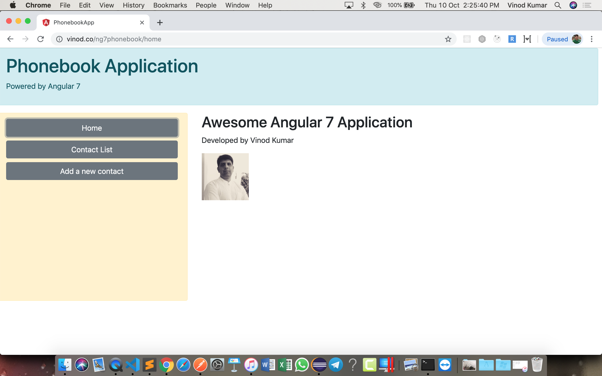
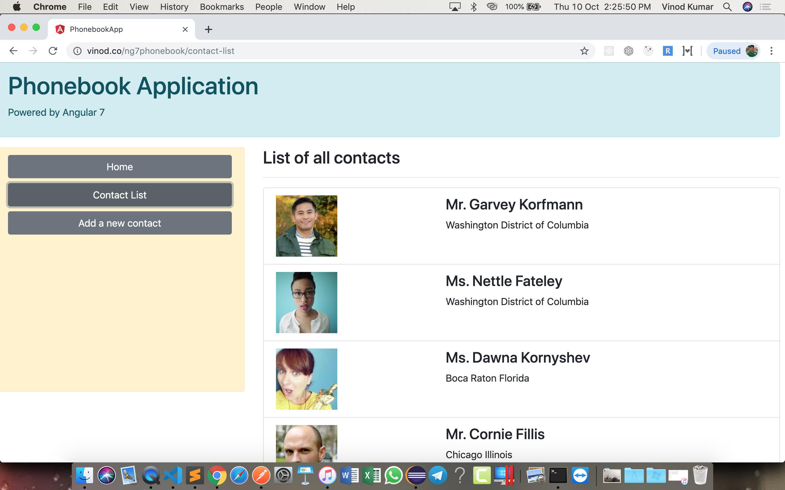
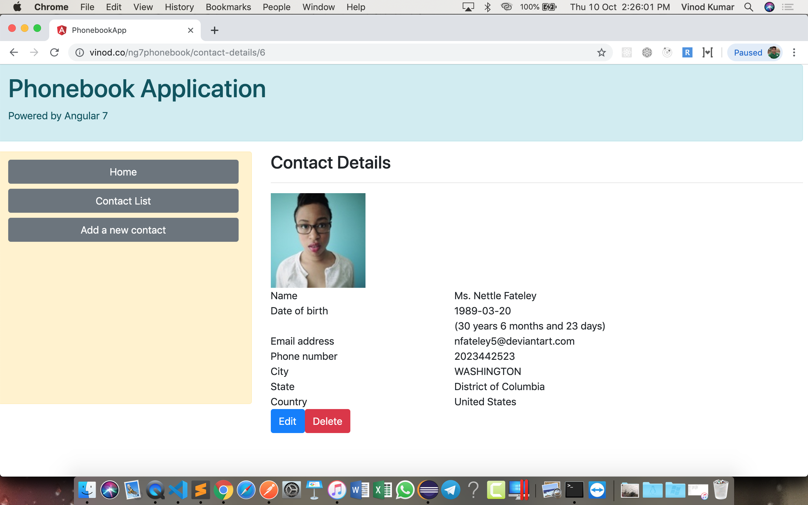
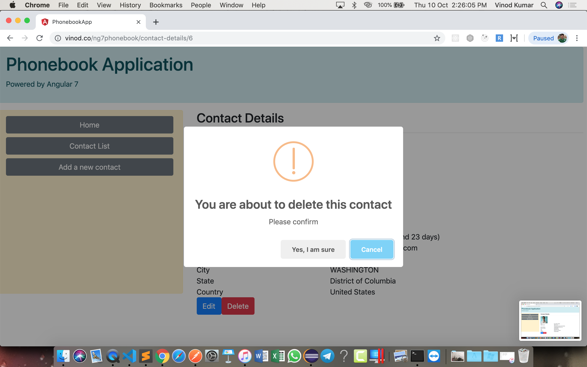
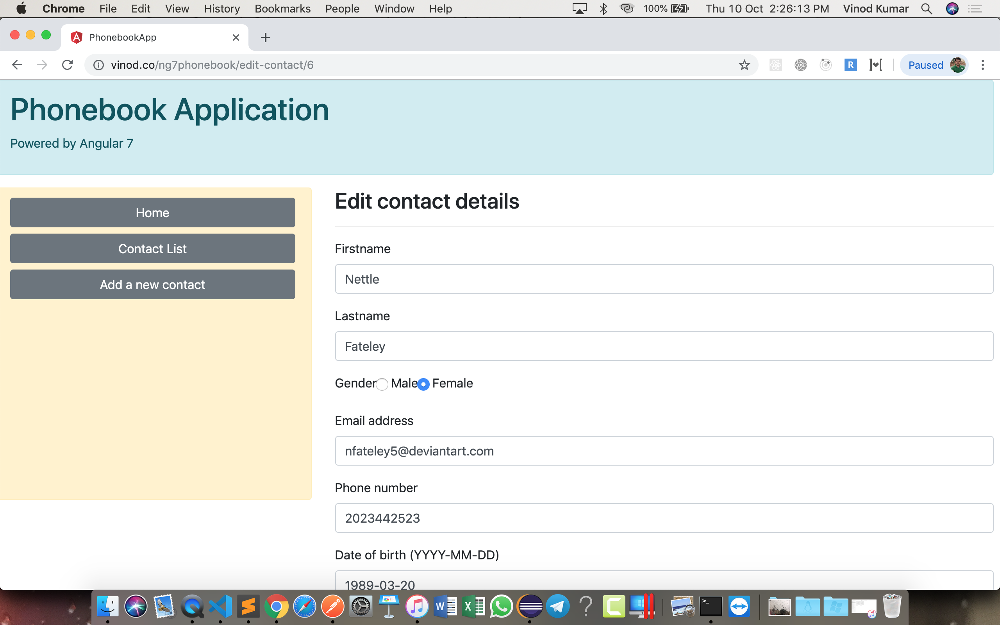
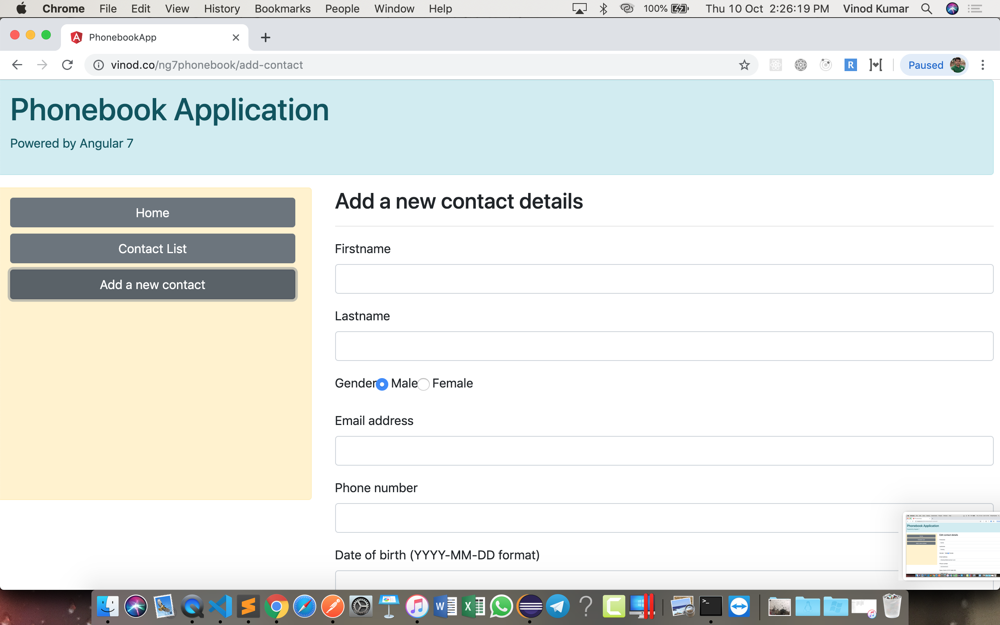

# Assignment

Create a Java Web Application to showcase a Phonebook. 

All the pages should have a consistent look and feel, with a header and sidebar. Header shows the application name and a title. Sidebar should show 3 links "Home", "Contact list" and "Add new contact".

## Homepage:

The homepage should display your (author's) name, picture and a welcome message.

##  Contact list:

On clicking the "Contact list" link/button, the user should be shown a list of all contacts as shown in the picture below:

Clicking the name/picture in the list for any contact should show the details of the same contact with all the details along with "Edit" and "Delete" buttons.

Clicking the "Delete" button should ask the user if he/she wants to delete the data permanently. (Use window.confirm() to do so). If the user confirms, then the record should be deleted, and the user is redirected to the home page.

Clicking the "Edit" button should display the details of the user in editable textfields (ref image below), and after making the changes, if the user clicks the "Save" button, the details should be saved and shown in a readonly format.

Clicking the "Add new contact" on the sidebar should display a blank form with textboxes and radio buttons to collect the details of the new contact. Also, clicking the "Save" button should add the details of the contact as a new record in the database table.

